# Hello! We are **Team KMIDS-GFM**.


# WRO - Future Engineers - Robotics Project Documentation

## Team Members

- **Chayanon Ninyawee (Garfield)**
- **Supakorn Sunthonthammarat (Pleum)**
- **Thammatouch Chantasarn (Kao)**

We are a team of dedicated students with a passion for robotics and innovation. This repository documents our full engineering process, including design, components used, development, testing, and coding of our robot.

<a name="top"></a>

## Table of Contents

<!-- toc -->

- [1. Overview](#1-overview)
  * [1.1 About the Project](#11-about-the-project)
  * [1.2 Robot Images](#12-robot-images)
  * [1.3 Performance Video](#13-performance-video)
- [2. Mobility Management](#2-mobility-management)
  * [2.1 Drive System](#21-drive-system)
  * [2.2 Steering](#22-steering)
  * [2.3 Chassis Design](#23-chassis-design)
- [3. Power and Sense Management](#3-power-and-sense-management)
  * [3.1 Power Source](#31-power-source)
  * [3.2 Sensor and Camera](#32-sensor-and-camera)
  * [3.3 Processing Units](#33-processing-units)
  * [3.4 Circuit Diagram](#34-circuit-diagram)
  * [3.5 Power Consumption](#35-power-consumption)
- [4. Obstacle Management](#4-obstacle-management)
  * [4.1 Open Challenge](#41-open-challenge)
  * [4.2 Obstacle Challenge](#42-obstacle-challenge)
  * [4.3 Parallel Parking](#43-parallel-parking)
- [5. Source Code](#5-source-code)
  * [5.1 Code Structure](#51-code-structure)
  * [5.2 Compilation / Upload Instructions](#52-compilation--upload-instructions)
- [6. List of Components](#6-list-of-components)
- [7. STL and Slicer Files](#7-stl-and-slicer-files)
- [8. Building Instructions](#8-building-instructions)
- [9. Extra Documentation](#9-extra-documentation)

<!-- tocstop -->

## 1. Overview

### 1.1 About the Project

This project focuses on designing, building, and programming an autonomous robot capable of completing a series of complex obstacle challenges as part of the WRO Future Engineers competition.

Team KMIDS-GFM was inspired by the challenge of applying engineering principles and problem-solving skills to creatively and efficiently solve complex problems. Pushing forward with our passion for innovation and hands-on learning.

Our goal is to design and build a reliable and efficient system that demonstrates our technical and collaborative skills while serving as a learning experience. We followed a systematic process, including brainstorming, researching, prototyping, testing, and iterating. We maintained detailed documentation to facilitate knowledge sharing and ensure a smoother workflow throughout the project.

Our robot is engineered using a custom modular chassis in a rear-wheel drive configuration, controlled using a Raspberry Pi 5 and a Raspberry Pi Pico 2. It utilizes a combination of an LIDAR sensor and a fish-eye lens camera to provide an advanced system for obstacle detection and navigation.

Our objective is to create an intelligent robot that is capable of navigating through obstacles with pinpoint precision and speed.

### 1.2 Robot Images

<table>
  <tr>
    <td align="center">
      <b>Front View</b><br>
      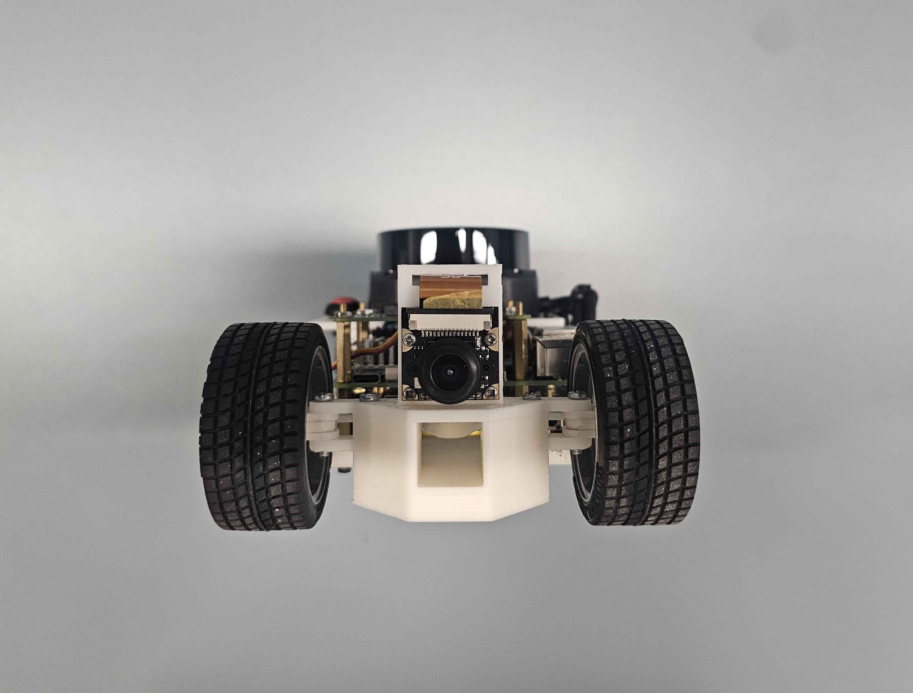
    </td>
    <td align="center">
      <b>Back View</b><br>
      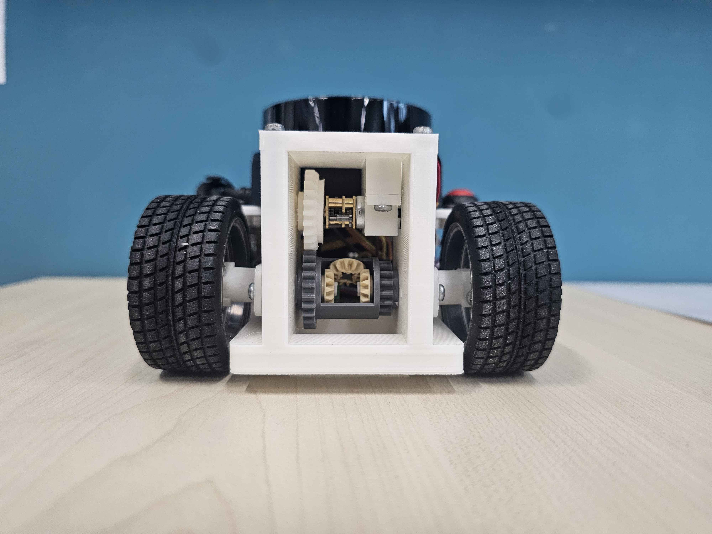
    </td>
    <td align="center">
      <b>Left Side View</b><br>
      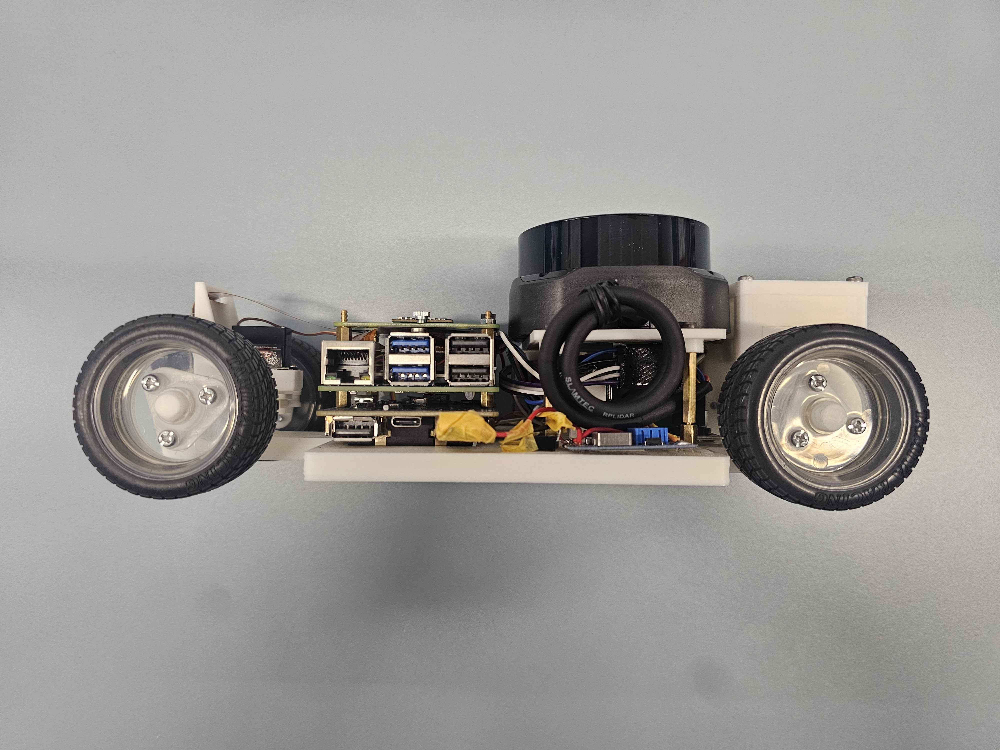
    </td>
  </tr>
  <tr>
    <td align="center">
      <b>Right Side View</b><br>
      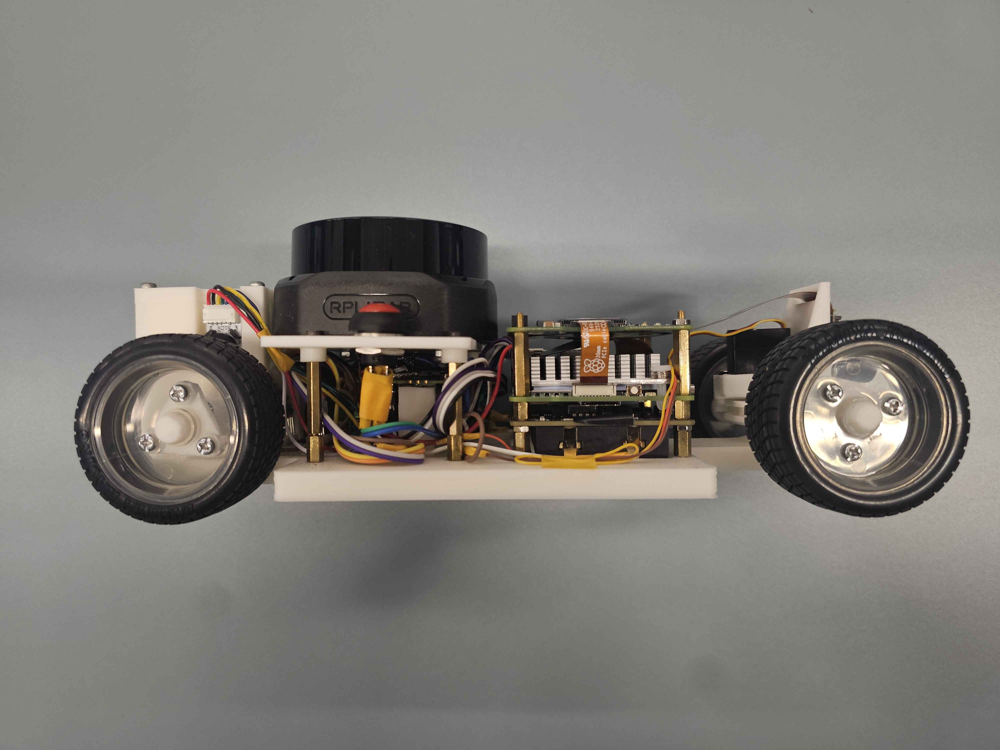
    </td>
  <td align="center">
  <b>Top View</b><br>
  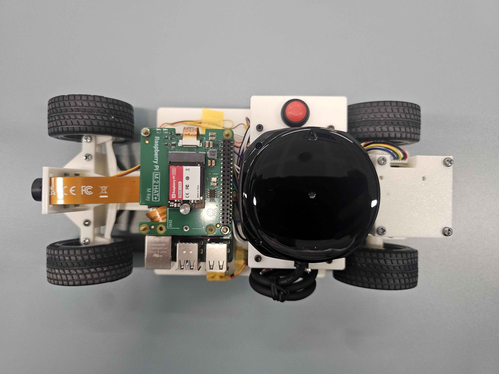
</td>
    <td align="center">
      <b>Bottom View</b><br>
      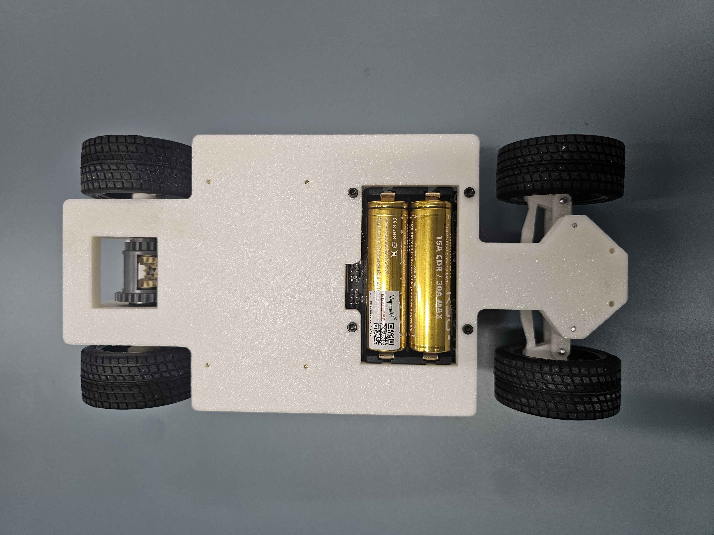
    </td>
  </tr>
</table>

### 1.3 Performance Video

[Watch on YouTube](https://youtu.be/hUqdMjxhbqM)

[](http://www.youtube.com/watch?v=hUqdMjxhbqM "Performance video")

The video shows both the open and obstacle challenge

[▲ Back to Top](#top)

## 2. Mobility Management

- **Drive System:** 2-wheel differential drive (rear wheels).
- **Steering:** Front-wheel steering using S0004m servo.

### 2.1 Drive System

[Motor: N20 Motor](https://shopee.co.th/product/627316253/26413874397?gads_t_sig=VTJGc2RHVmtYMTlxTFVSVVRrdENkWVp3RFo3Mkw5czd4Z0hzdEF1WVFibXlBTE5VQ0pKTTRUMjllaFljblI4VVUzZVlWanM3K21aUFJRVnpoZE9HY3Y0bnAxT3daaXVtOUhoZXZ2ZDJzRzNkcmkzQ3VRNjdSUU5oNGRQZzIwbEE3UDA5LzQ3K2JpMWZKeEtQbHVsS2FnPT0&gad_campaignid=17496928273)

<table>
  <tr>
    <td align="center" width="300" >
      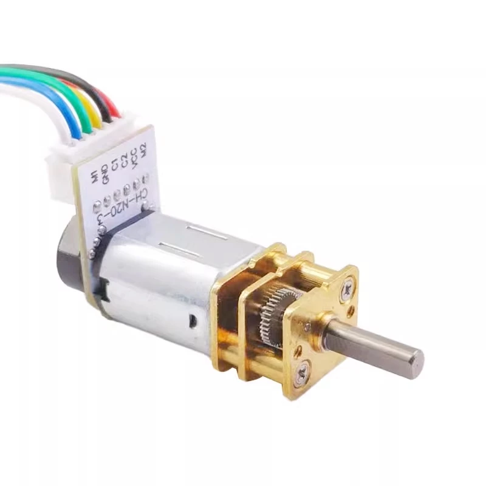
    </td>
    <td>
      <h3>Specifications:</h3>
      <ul>
        <li>Voltage: 6V </li>
        <li>No-load Speed: 500RPM </li>
        <li>Stall Torque 0.15kg-cm</li>
        <li>Current: 0.023A</li>
        <li>Gear Ratio: 1:100</li>
      </ul>
    </td>
  </tr>
</table>

**Reason for Selection:**

- It is compact and lightweight, allowing us to fit it into our robot easily.
- Provides moderate torque that is more than enough for the flat arena.
- Easy to use on the robot and integrate with other parts.

The N20 motor is equipped with an encoder to provide precise motion feedback, ensuring the robot’s movements are accurate. The motor drives the rear wheels through a LEGO differential gear system, which allows the robot to maintain smooth and balanced turns even at higher speeds. By distributing torque between the two wheels, the differential minimizes wheel slip and ensures stability during sharp maneuvers.
The integration of encoders with the N20 motors provides real-time feedback for closed-loop control, enabling precise speed regulation and consistent lap performance. Although the torque of the N20 is modest, the combination with the differential gear makes it well-suited for the flat and predictable competition arena, striking a balance between efficiency, stability, and mechanical simplicity.

**Mounting:**

- Installed using 3D-printed motor clamps screwed to a detachable motor plate that is placed above the differential gear compartment. This will allow for future changes to accommodate bigger motors and gears. [Motor Clamp](./FreeCAD-Files/Assembly/mesh_export/MotorHolder_1x.stl) [Motor Plate](./FreeCAD-Files/Assembly/mesh_export/MotorPlate_1x.stl)

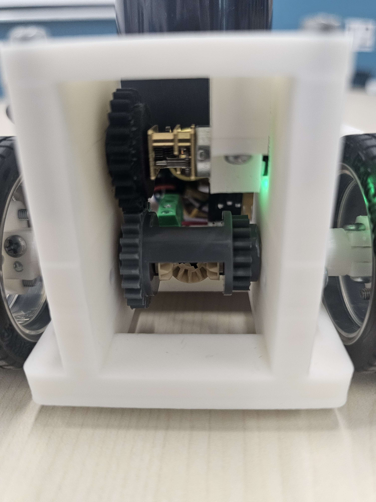

- Wires connected to Raspberry Pi Pico 2.
- Rubber wheels are screwed onto the motor shaft.

**Considerations:**
To reach a faster speed, we can upgrade the N20 motor to the N30, which is the easiest upgrade, providing an overall improvement in speed and torque. However, the N30 motor is typically larger and such, might need extra modifications to the robot's chassis and motor clamp to fit properly. It also generally operates at higher voltages and currents, so the power supply needs to be modified to support this upgrade.

### 2.2 Steering


[Servo: S0004m](https://shopee.co.th/%E0%B9%80%E0%B8%8B%E0%B8%AD%E0%B8%A3%E0%B9%8C%E0%B9%82%E0%B8%A7%E0%B8%94%E0%B8%B4%E0%B8%88%E0%B8%B4%E0%B8%97%E0%B8%B1%E0%B8%A5-%E0%B8%82%E0%B8%99%E0%B8%B2%E0%B8%94%E0%B9%80%E0%B8%A5%E0%B9%87%E0%B8%81-2-%E0%B8%81%E0%B8%A3%E0%B8%B1%E0%B8%A1-3.7-%E0%B8%81%E0%B8%A3%E0%B8%B1%E0%B8%A1-4.3-%E0%B8%81%E0%B8%A3%E0%B8%B1%E0%B8%A1-6-%E0%B8%81%E0%B8%A3%E0%B8%B1%E0%B8%A1-8-%E0%B8%81%E0%B8%A3%E0%B8%B1%E0%B8%A1-3.7V-6.0V-DC-%E0%B8%AA%E0%B9%8D%E0%B8%B2%E0%B8%AB%E0%B8%A3%E0%B8%B1%E0%B8%9A%E0%B8%AB%E0%B8%B8%E0%B9%88%E0%B8%99%E0%B8%A2%E0%B8%99%E0%B8%95%E0%B9%8C-%E0%B9%80%E0%B8%84%E0%B8%A3%E0%B8%B7%E0%B9%88%E0%B8%AD%E0%B8%87%E0%B8%9A%E0%B8%B4%E0%B8%99%E0%B8%9A%E0%B8%B1%E0%B8%87%E0%B8%84%E0%B8%B1%E0%B8%9A-1-%E0%B8%8A%E0%B8%B4%E0%B9%89%E0%B8%99-i.53028894.18020081677?is_from_login=true)

<table>
  <tr>
    <td align="center" width="300" >
      
    </td>
    <td> 
      <h3>Specifications:</h3>
      <ul>
          <li>Rated Torque: 0.6kgf-cm</li>
          <li>Speed: 0.09sec/60°</li>
          <li>Voltage: 5V</li>
          <li>Gearing: Plastic</li>
          <li>Type: Digital </li>
      </ul>
    </td>
  </tr>
</table>

**Reason for Selection:**

- The small size and PWM interface make it easy to control via Raspberry Pi Pico 2.
- It has sufficient torque to steer the front wheels responsively.
- It has balanced speed and stability during turns and lane changes.
- This servo is widely used in hobby robotics, and as such, there is much available documentation and mounting kits.

We considered many steering systems, but following our design principle of precision, we decided to implement Ackermann steering geometry to better replicate the precise turning behavior of real-world vehicles.

Unlike simpler systems, Ackermann steering has the advantage of smoother turns by moving each wheel at different angles in a turn, reducing the slippage of the tires and improving turn accuracy.

The fundamental principle of Ackermann geometry involves positioning the steering linkage so that a line drawn through both front wheels intersects the rear axle of the robot.


While this steering geometry is complex to implement, we believe that the advantages it provides are important — especially in obstacle navigation and parking, where precise control and a minimized turning radius are essential. It enables smoother maneuvering and accurate alignment in narrower spaces.

Our implementation comes in the form of a custom 3D-printed Ackermann steering mechanism, which offers the following key aspects:

- We used FreeCAD to experiment with different pivot points and steering angles step by step.
- Although true Ackermann geometry is difficult to achieve at our robot's small scale, we aimed to approximate the behavior through multiple design iterations.
- Adjustments were made to the servo horns and steering angles directly in CAD before testing.

**Calibration and Implementation**

To make sure the steering angle performed correctly, we carried out an iterative calibration process:

- We manually adjusted the servo horn angle and linkage positions step by step in FreeCAD until the wheels aligned at the desired steering angle.
- After each adjustment, we observed whether the wheels tracked correctly in both directions.
- Once the optimal angle is reached, we make sure to model the steering mechanism around the angle.

**Mounting:**

- Screwed directly into a platform plate in front of the chassis, connected to the steering mechanism.

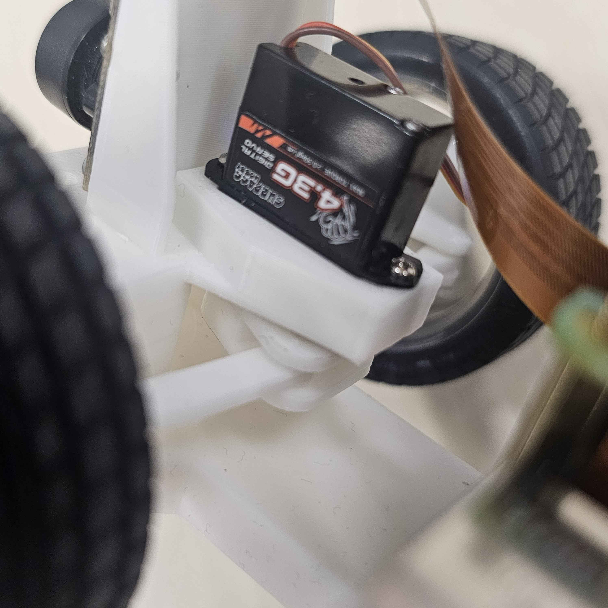

**Considerations**
While the servo used is adequate for the task, it can still be replaced with something more precise. We plan to upgrade to a high-resolution digital servo with a narrower deadband and metal gears for more accurate movement. By also integrating a PWM driver such as the PCA9685, we gain 12-bit resolution control, which gives the robot the ability to make finer adjustments than the Raspberry Pi’s native PWM.

### 2.3 Chassis Design

**Chassis Overview:**


| Dimensions: | Length (mm) |
| ----------- | ----------- |
| Width       | 244         |
| Length      | 120         |
| Height      | 59          |

**Design Overview**

Our chassis was designed with a focus on weight and modularity. The goal is for our chassis to be a stable platform on which we can implement the steering geometry while also allowing components to remain centerd on the chassis.

**Layout**

The layout of the chassis is made to fit the rear-mounted motors and front-mounted steering mechanism. Meanwhile, electronics and sensors are mounted in the center for ease of wiring.

Our robot chassis was completely custom-designed in FreeCAD and 3D printed using [esun PLA+](https://esun3dstore.com/products/pla-pro), which we found is easy to print with, offering a smoother texture and less warping compared to ABS, while also being lightweight and durable. Alongside the main chassis, the drivetrain and steering modules are mounted on our 3D-printed detachable plates that were fine-tuned during testing to achieve the correct alignment with other components. Other components, such as motor clamps and sensor brackets, are designed as independent printable components. The chassis was also designed with modularity in mind for replacements and upgrades, with reduced overhangs for printing ease.

[▲ Back to Top](#top)

## 3. Power and Sense Management

### 3.1 Power Source

[Battery: 18650 Lithium-Ion](https://th.cytron.io/p-3.7v-2000mah-li-ion-battery)

<table>
  <tr>
    <td align="center" width="300" >
      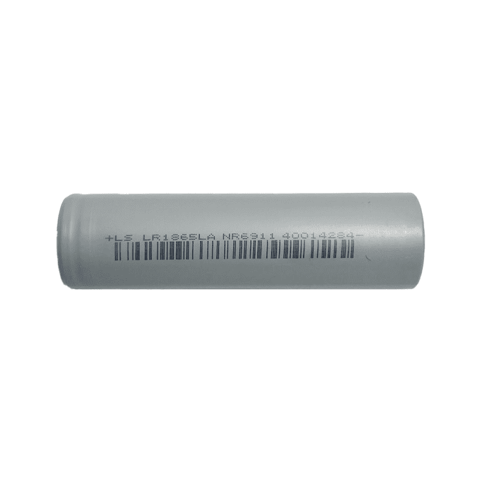
    </td>
    <td>
      <h3>Specifications:</h3>
      <ul>
          <li>Capacity: 2000 mAh</li>
          <li>Normal voltage: 3.7V</li>
          <li>Standard discharge: 10A </li>
          <li>Weight: 48g</li>
      </ul>
    </td>
  </tr>
</table>

The power and sensor systems are crucial to the vehicle's ability to navigate the challenges of the competition. For this project, our vehicle is powered by an [EP-0136 Raspberry Pi UPS](https://wiki.52pi.com/index.php?title=EP-0136) (Uninterruptible Power Supply), with 2x 18650 Lithium-Ion as the energy source. The UPS maintains a stable 5V output to the Raspberry Pi 5 even during fluctuations. It also has built-in charging and voltage regulation circuits, allowing continuous operation while also recharging the batteries when external power is connected.
The batteries are connected in series to provide a nominal voltage of 7.4V and a combined capacity of around 4000 mAh, depending on the cells used. This setup is capable of delivering a continuous current of around 20 Amps, which is sufficient to supply to the robot for various tasks. This setup ensures that the Raspberry Pi won't shut down unexpectedly, allowing uninterrupted data processing and decision-making throughout the run.

The motors, however, require a higher voltage — at least 6V, and to ensure reliable performance, the N20 motor power is supplied through a step-up converter that increases 5V to 12V. Because the motor power is separate from the Raspberry Pi, the standard on/off switch could not fully control the system. To solve this, a MOSFET and a 4.4 kΩ resistor were added between the gate and source, with the drain connected to the negative side of the step-up converter. This allows the robot to be safely powered on and off while supplying sufficient power to both the Raspberry Pi and the motors.

The onboard processing unit, the Raspberry Pi 5, serves as the vehicle's brain. Raspberry Pi recommends a 5V 5A power supply. This is well within the limits of what the two batteries can provide.

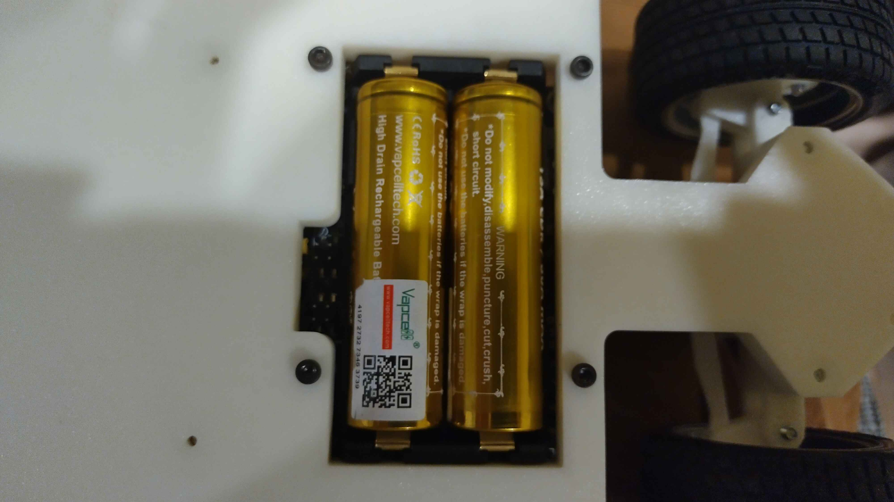 

### 3.2 Sensor and Camera

[LIDAR Sensor: RPLIDAR S2](https://www.slamtec.com/en/S2)

<table>
  <tr>
    <td align="center" width="300" >
      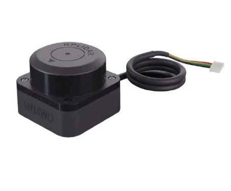
    </td>
    <td>
      <h3>Specifications:</h3>
      <ul>
        <li>Distance Range:
          <ul>
            <li>White: 0.05-30m（90% Reflection）</li>
            <li>Black: 0.05-10m（10% Reflection）</li>
          </ul>
        </li>
        <li>Angle Resolution: 0.1125°</li>
        <li>Accuracy: ±30mm</li>
        <li>Scan Rate: 10Hz</li>
        <li>Distance Resolution: 13mm</li>
        <li>Discharge Rate: 30C</li>
        <br/><br/>
      </ul>
    </td>
  </tr>
</table>

**Reason for Selection:**

- **Precise distance measurement** of obstacles within a wide radius
- **360° scanning** makes it ideal for SLAM (Simultaneous Localisation and Mapping).
- **Compact size and lightweightness** allow easy fitting on our robot.
- **Fast sampling rate** allows real-time mapping and obstacle avoidance.

**The LIDAR sensor is used mainly for the following tasks:**

- Wall following and collision Avoidance

- Obstacle detection

- Identify parking space and assist in the parallel parking manoeuvre

- Mapping and determining initial orientation

[Camera: Fish Eye Lens Raspberry Pi 5MP IR Camera](https://th.cytron.io/p-fish-eye-lense-raspberry-pi-5mp-ir-camera?r=1&language=en-gb&gad_campaignid=18809653822)

<table >
  <tr>
    <td align="center" width="300" >
      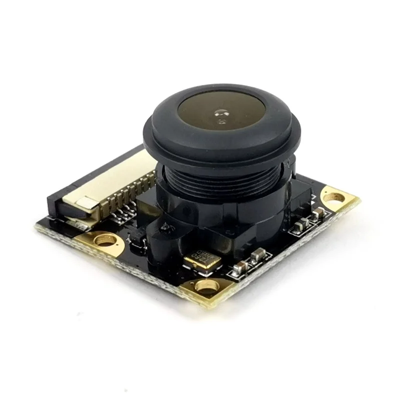
    </td>
    <td >
      <h3>Specifications:</h3>
      <ul>
        <li>Voltage: 6V</li>
        <li>Resolution: 5MP </li>
        <li>Focal Length: Adjustable</li>
        <li>Image Sensor: OV5647</li>
        <li>Aperture: F2.35</li>
      </ul>
    </td>
  </tr>
</table>

**Reason for Selection:**

- **130° wide field of view** from the fish-eye lens captures a large area for tracking compared to a regular lens.
- **Infrared compatibility** enables low-light vision.
- **High-resolution (5MP)** provides a clear image for the robot.
- **Compact size** fits well on our robot and is lightweight.

This setup allows for a wide-angle view, enhancing environmental awareness during both the Open Challenge and Obstacle Challenge. The camera identifies course elements such as walls, pillars, colored markers, parking spaces, and lane lines.

**The camera is used mainly for the following tasks:**

- Detect and differentiate wall positions.

- Identify pillar colors and types.

- Recognize parking zones.

- Track path lines and boundaries.

### 3.3 Processing Units

[Single Board Computer: Raspberry Pi 5](https://gammaco.com/gammaco/Raspberry_Pi_GB_89RD014.html)

<table>
  <tr>
    <td align="center" width="300" >
      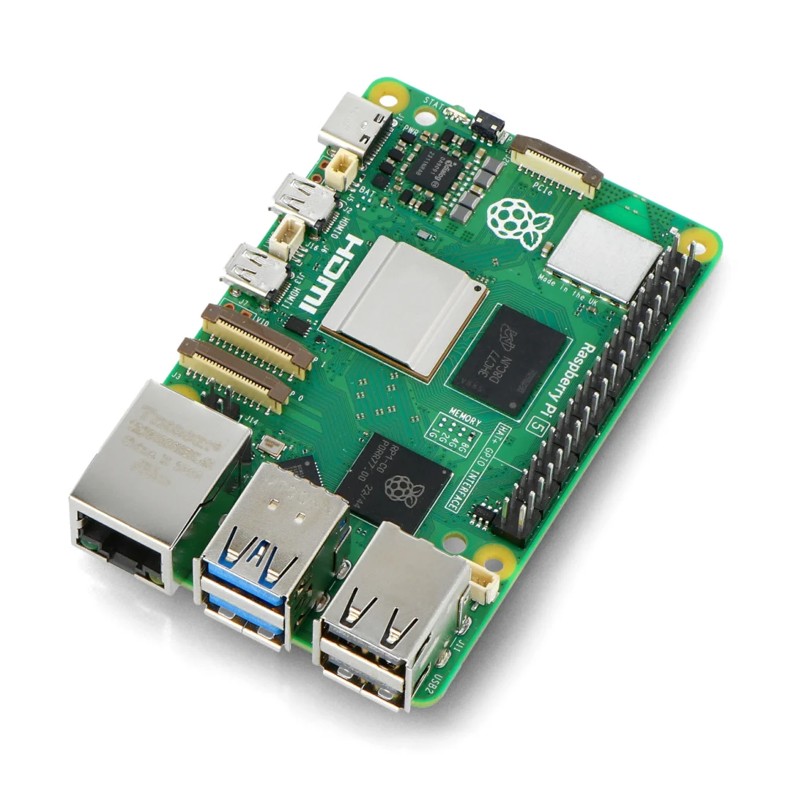
    </td>
    <td>
      <h3>Specifications:</h3>
      <ul>
        <li>Quad-core Arm Cortex-A76 CPU @ 2.4GHz</li>
        <li>8GB LPDDR4X RAM</li>
        <li>Dual 4K HDMI output (60fps)</li>
        <li>PCIe 2.0 support via FPC connector</li>
        <li>2x USB 3.0 ports, 2x USB 2.0 ports</li>
      </ul>
    </td>
  </tr>
</table>

[Microcontroller: Raspberry Pi Pico 2](https://th.cytron.io/p-raspberry-pi-pico2-board)

<table>
  <tr>
    <td align="center" width="300" >
      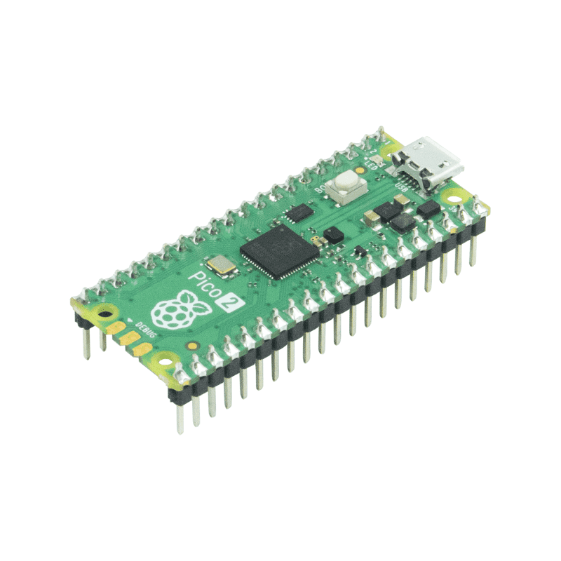
    </td>
    <td>
      <h3>Specifications:</h3>
      <ul>
        <li>Dual ARM Cortex-M33</li>
        <li>4 MB QSPI flash memory</li>
        <li>520KB SRAM</li>
        <li>2.4GHz 802.11n wireless LAN</li>
        <li>26 multi-function GPIO pins</li>
      </ul>
    </td>
  </tr>
</table>

[Adapter Board: Raspberry Pi M.2 HAT+](<>)

<table>
  <tr>
    <td align="center" width="300" >
      
    </td>
    <td>
      <h3>Specifications:</h3>
      <ul>
          <li>Interface: PCIe 2.0 x1 (via 16-pin FPC connector)</li>
          <li>Supported Devices: NVMe M.2 M-key SSDs (2280/2242/2230 sizes)</li>
          <li>Data Transfer Rate: Up to 5 Gbps</li>
          <li>Power Supply: 3.3V from Raspberry Pi 5 (max 2A output)</li>
      </ul>
    </td>
  </tr>
</table>

[Motor Driver: DRV8871](<>)

<table>
  <tr>
    <td align="center" width="300">
      
    </td>
    <td>
      <h3>Specifications:</h3>
      <ul>
          <li>Operating Voltage Range: 6.5V – 45V</li>
          <li>Peak Output Current: 3.6A</li>
          <li>Typical R<sub>DS(on)</sub> (high + low): 565mΩ</li>
          <li>Logic Level Input Voltage: Up to 5.5V on IN pins </li>
      </ul>
      </ul>
    </td>
  </tr>
</table>

[Transistor: N-Channel MOSFET ](<>)

<table>
  <tr>
    <td align="center" width="300">
      
    </td>
    <td>
      <h3>Specifications:</h3>
      <ul>
          <li>Type: N-Channel Enhancement Mode MOSFET</li>
          <li>Drain-Source Voltage (Vds): 30V ~ 60V </li>
          <li>Continuous Drain Current (Id): 20A ~ 40A</li>
          <li>Gate Threshold Voltage (Vgs(th)): 1V ~ 3V</li>
          <li>R<sub>DS(On-Resistance)</sub>: 0.02Ω ~ 0.05Ω </li>
          <li>Gate-Source Voltage (Vgs max): ±20V</li>
          <li>Power Dissipation: 30W ~ 60W</li>
          <li>Package Type: TO-220 / TO-247 (common formats)</li>
          <li>Typical Applications: Motor drivers, power switching, DC-DC converters</li>
      </ul>
    </td>
  </tr>
</table>

### 3.4 Circuit Diagram

**Wiring Diagram:**


We had to decide on whether to do a PCB or use jumper wires to connect each component. In the end, we settled on using jumper wires as it gives us more flexibility during our development in case an error happens, and allows us to troubleshoot each part easily without having to redesign the circuit board.

### 3.5 Power Consumption

| Component                     | Supply (V) | Typical Current (A) | Peak Current (A) | Typical Power (W) |
| ----------------------------- | ---------- | ------------------- | ---------------- | ----------------- |
| Raspberry Pi 5                | 5          | 2.50                | 5.00             | 12.50             |
| Raspberry Pi Pico 2           | 5          | 0.05                | 0.10             | 0.25              |
| RPLIDAR S2                    | 5          | 0.45                | 0.60             | 2.25              |
| 5MP Fish Eye Lens Camera      | 5          | 0.12                | 0.25             | 0.60              |
| Micro Servo S0004m (steering) | 5          | 0.12                | 0.65             | 0.60              |
| N20 DC Motor                  | 12         | 0.30                | 1.50             | 7.20              |
| DRV8871 Motor Driver          | 12         | 0.01                | 0.04             | 0.24              |
| Raspberry Pi M.2 HAT+         |            |                     |                  |                   |
| Step-Up Converter             | —          | —                   | —                | η ≈ 88%           |

[▲ Back to Top]

## 4. Obstacle Management

There are two challenges in this competition:

- The **open challenge** involves the robot completing three full laps around the field without touching the wall. The size of each side of the field and the direction in which the car drives are randomised.
- The **obstacle challenge** requires the robot to complete three laps while avoiding the traffic signs. If the sign is red, then the robot must traverse on the right side and if the pillar is green, the robot must traverse on the left. The direction in which the car drives and the placement of the signs are randomised. After the third lap, the car must find the parking area and park in the area without touching the surrounding barriers around it.

Our implementation relies heavily on the RPLIDAR S2 sensor and the fish-eye lens camera for continuous environment scanning, which helps the algorithm decide the movement of the robot.

We divide the strategy into three phases:

- Open Challenge
- Obstacle Challenge
- Parallel Parking Manoeuvre

### 4.1 Open Challenge

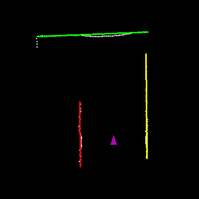\
*Figure: Example of robot sensing walls and navigating the field.*

The Open Challenge requires the robot to complete three laps around the arena without touching the walls. The driving direction is randomised at the start, so relying on pre-programmed movements is not feasible

The robot determines which direction to turn by analysing the walls detected around it. The algorithm works as follows:

1. **Check for empty walls:**

   - If there are no front walls or no side walls, the function returns `std::nullopt` because it cannot determine a turn direction.

1. **Identify the closest front wall:**

   - Compares all front wall line segments and selects the one with the highest midpoint (largest Y value).
   - Determines the left and right points of this front wall based on their X coordinates.

1. **Evaluate left walls:**

   - Finds the "higher" point of each left wall line segment.
   - Uses `perpendicularDirection` and `perpendicularDistance` to determine if a left turn is feasible.
   - Returns `COUNTER_CLOCKWISE` if a left turn is clear, or `CLOCKWISE` if blocked.

1. **Evaluate right walls:**

   - Similarly, checks the right wall line segments.
   - Returns `CLOCKWISE` if a right turn is clear, or `COUNTER_CLOCKWISE` if blocked.

1. **Fallback:**

   - If no rules match, returns `std::nullopt`, indicating that the turn direction cannot be determined.

<details>
<summary>Click here to show C++ code</summary>

getTurnDirection code (from [lidar_processor.h](code/raspberry-pi-5/src/processors/lidar/lidar_processor.h) / [lidar_processor.cpp](code/raspberry-pi-5/src/processors/lidar/lidar_processor.cpp))

```cpp
/**
 * @brief Determine the robot's turn direction based on relative walls.
 *
 * @param walls Resolved or candidate walls around the robot.
 * @return Optional RotationDirection; empty if turn direction can't be determined.
 */
std::optional<RotationDirection> getTurnDirection(const RelativeWalls &walls) {
    if (walls.frontWalls.empty()) return std::nullopt;
    if (walls.leftWalls.empty() && walls.rightWalls.empty()) return std::nullopt;

    // Pick the highest front line
    const LineSegment *frontLine = &walls.frontWalls[0];
    float frontMidY = (frontLine->y1 + frontLine->y2) / 2.0f;
    for (const auto &line : walls.frontWalls) {
        float midY = (line.y1 + line.y2) / 2.0f;
        if (midY > frontMidY) {
            frontLine = &line;
            frontMidY = midY;
        }
    }

    // Determine left and right points of the front line
    float frontLeftX, frontLeftY, frontRightX, frontRightY;
    if (frontLine->x1 < frontLine->x2) {
        frontLeftX = frontLine->x1;
        frontLeftY = frontLine->y1;
        frontRightX = frontLine->x2;
        frontRightY = frontLine->y2;
    } else {
        frontLeftX = frontLine->x2;
        frontLeftY = frontLine->y2;
        frontRightX = frontLine->x1;
        frontRightY = frontLine->y1;
    }

    // Check left walls
    for (const auto &leftLine : walls.leftWalls) {
        float leftHigherX, leftHigherY;
        if (leftLine.y1 < leftLine.y2) {
            leftHigherX = leftLine.x1;
            leftHigherY = leftLine.y1;
        } else {
            leftHigherX = leftLine.x2;
            leftHigherY = leftLine.y2;
        }

        // Check for left wall that is far away in x direction from front wall
        float dir = leftLine.perpendicularDirection(frontLeftX, frontLeftY);
        if (dir > 90.0f && dir < 270.0f) {
            if (leftLine.perpendicularDistance(0.0f, 0.0f) > 1.70f) return RotationDirection::COUNTER_CLOCKWISE;

            continue;
        }

        if (frontLine->perpendicularDistance(leftHigherX, leftHigherY) < 0.30) return RotationDirection::CLOCKWISE;

        if (leftLine.perpendicularDistance(frontLeftX, frontLeftY) > 0.30f) {
            float dir = leftLine.perpendicularDirection(frontLeftX, frontLeftY);
            if (dir > 270.0f || dir < 90.0f) return RotationDirection::COUNTER_CLOCKWISE;
        }
    }

    // Check right walls
    for (const auto &rightLine : walls.rightWalls) {
        float rightHigherX, rightHigherY;
        if (rightLine.y1 < rightLine.y2) {
            rightHigherX = rightLine.x1;
            rightHigherY = rightLine.y1;
        } else {
            rightHigherX = rightLine.x2;
            rightHigherY = rightLine.y2;
        }

        // Check for right wall that is far away in x direction from front wall
        float dir = rightLine.perpendicularDirection(frontRightX, frontRightY);
        if (dir > 270.0f || dir < 90.0f) {
            if (rightLine.perpendicularDistance(0.0f, 0.0f) > 1.70f) return RotationDirection::CLOCKWISE;

            continue;
        }

        if (frontLine->perpendicularDistance(rightHigherX, rightHigherY) < 0.30) return RotationDirection::COUNTER_CLOCKWISE;

        if (rightLine.perpendicularDistance(frontRightX, frontRightY) > 0.30f) {
            float dir = rightLine.perpendicularDirection(frontRightX, frontRightY);
            if (dir > 90.0f && dir < 270.0f) return RotationDirection::CLOCKWISE;
        }
    }

    return std::nullopt;  // unknown if no rule matched
}
```

</details>

### 4.2 Obstacle Challenge

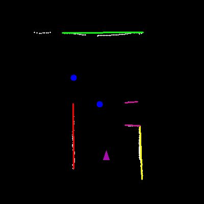
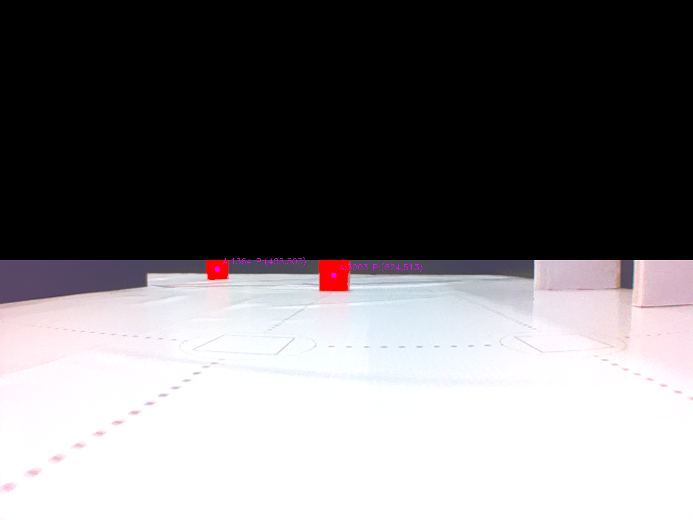

*Figure: Example of the robot detecting traffic lights.*

The Obstacle Challenge requires the robot to navigate the arena while avoiding obstacles and detecting traffic lights. The robot combines LiDAR and camera data to make real-time decisions. The main processing steps are:

1. **Determine turn direction**

   - Uses the same algorithm as in the Open Challenge to decide whether to turn CLOCKWISE or COUNTER_CLOCKWISE based on the surrounding walls.
   - If no clear direction is detected, the default is CLOCKWISE.

1. **Convert LiDAR data to Cartesian coordinates**

   - LiDAR points that are too close (< 0.005 m), too far (> 3.2 m), or outside the forward scanning range are ignored.
   - Converts polar coordinates (distance, angle) to Cartesian coordinates relative to the robot.

1. **Filter points based on walls and turn direction**

   - Depending on the current turn direction, left, right, and far walls are used to remove points that are too close to obstacles.
   - Thresholds (`outerEdge = 0.30 m`, `innerEdge = 0.70 m`) define valid regions for candidate traffic lights.

1. **Cluster nearby LiDAR points**

   - Points within `distanceThreshold` (default 0.05 m) are grouped together.
   - Each cluster is averaged to generate a candidate traffic light location.

1. **Filter camera colors**

   - The camera frame is converted to HSV color space.
   - Thresholded for red, green, and pink colors.
   - The top 50% of the frame is blacked out to reduce noise from the ceiling or irrelevant background.
   - Contours are extracted, and only those larger than the `areaThreshold` are kept.

1. **Combine camera and LiDAR data**

   - For each detected camera block (red/green), find the closest LiDAR point within a maximum allowed horizontal angle difference.
   - Only the nearest point along the ray is matched to prevent duplicate detections.
   - Returns a vector of `TrafficLightInfo` containing both the LiDAR location and the camera block information.

1. **Decision making**

   - Using the combined traffic light data, the robot can identify which traffic light is relevant for its current path.
   - Integrates turn direction, obstacle positions, and traffic light locations to navigate safely and efficiently.

<details>
<summary>Click here to show C++ code for Obstacle Challenge processing</summary>

getTrafficLightPoints code (from [lidar_processor.h](code/raspberry-pi-5/src/processors/lidar/lidar_processor.h) / [lidar_processor.cpp](code/raspberry-pi-5/src/processors/lidar/lidar_processor.cpp)) <!--TODO: Add link to the actual file-->

```cpp
/**
 * @brief Detect traffic light points from LiDAR data and resolved walls.
 *
 * @param timedLidarData LiDAR scan data with timestamps.
 * @param resolveWalls Resolved walls around the robot.
 * @param turnDirection Optional turn direction of the robot (if has no value, assume CLOCKWISE).
 * @param distanceThreshold Maximum distance between points to cluster into a single traffic light point.
 * @return Vector of 2D points representing detected traffic light locations.
 */
std::vector<cv::Point2f> getTrafficLightPoints(
    const TimedLidarData &timedLidarData,
    const ResolvedWalls resolveWalls,
    std::optional<RotationDirection> turnDirection,
    float distanceThreshold
) {
    // Convert polar to Cartesian (in meters)
    std::vector<cv::Point2f> points;
    points.reserve(timedLidarData.lidarData.size());

    for (const auto &node : timedLidarData.lidarData) {
        // TODO: Change this value to fit the actual robot
        if (node.distance < 0.005) continue;
        if (node.distance > 3.200) continue;
        if (node.angle > 5 && node.angle < 175 && node.distance > 0.700) continue;

        float rad = node.angle * static_cast<float>(M_PI) / 180.0f;

        float lidarX = node.distance * std::sin(rad);
        float lidarY = node.distance * std::cos(rad);
        float x, y;
        lidarToCartesian(lidarX, lidarY, x, y);

        points.emplace_back(x, y);
    }

    std::vector<cv::Point2f> filteredPoints;
    for (auto &point : points) {
        if (not resolveWalls.frontWall) return {};
        float frontDistance = resolveWalls.frontWall->perpendicularDistance(point.x, point.y);

        std::optional<LineSegment> outerWall, innerWall, farOuterWall;
        if (turnDirection.value_or(RotationDirection::CLOCKWISE) == RotationDirection::CLOCKWISE) {
            outerWall = resolveWalls.leftWall;
            innerWall = resolveWalls.rightWall;

            farOuterWall = resolveWalls.farRightWall;
        } else {
            outerWall = resolveWalls.rightWall;
            innerWall = resolveWalls.leftWall;

            farOuterWall = resolveWalls.farLeftWall;
        }

        float outerDistance;
        if (outerWall) {
            outerDistance = outerWall->perpendicularDistance(point.x, point.y);
        } else if (innerWall) {
            outerDistance = 1.00f - innerWall->perpendicularDistance(point.x, point.y);
        } else {
            return {};
        }

        // TODO: Clean up this magic number
        const float outerEdge = 0.30f;
        const float innerEdge = 0.70f;

        if (farOuterWall) {
            float outerFarDistance = farOuterWall->perpendicularDistance(point.x, point.y);

            if (frontDistance < outerEdge or frontDistance > 3.00f - outerEdge or outerDistance < outerEdge or outerFarDistance < outerEdge)
                continue;
            if (frontDistance > innerEdge and outerDistance > innerEdge and outerFarDistance > innerEdge) continue;
        } else {
            if (frontDistance < outerEdge or frontDistance > 3.00f - outerEdge or outerDistance < outerEdge or
                outerDistance > 3.00f - outerEdge)
                continue;
            if (frontDistance > innerEdge and outerDistance > innerEdge) continue;
        }

        filteredPoints.push_back(point);
    }

    std::vector<cv::Point2f> averages;
    if (filteredPoints.empty()) return averages;

    std::vector<cv::Point2f> currentCluster;
    currentCluster.push_back(filteredPoints[0]);

    for (size_t i = 1; i < filteredPoints.size(); ++i) {
        cv::Point2f p1 = currentCluster.back();
        cv::Point2f p2 = filteredPoints[i];

        float dist = std::hypot(p2.x - p1.x, p2.y - p1.y);

        if (dist < distanceThreshold) {
            currentCluster.push_back(p2);
        } else {
            // compute average for current cluster
            float sumX = 0, sumY = 0;
            for (auto &p : currentCluster) {
                sumX += p.x;
                sumY += p.y;
            }
            averages.emplace_back(sumX / currentCluster.size(), sumY / currentCluster.size());

            // start new cluster
            currentCluster.clear();
            currentCluster.push_back(p2);
        }
    }

    // handle last cluster
    if (!currentCluster.empty()) {
        float sumX = 0, sumY = 0;
        for (auto &p : currentCluster) {
            sumX += p.x;
            sumY += p.y;
        }
        averages.emplace_back(sumX / currentCluster.size(), sumY / currentCluster.size());
    }

    return averages;
}
```

filterColors code (from [lidar_processor.h](code/raspberry-pi-5/src/processors/lidar/lidar_processor.h) / [lidar_processor.cpp](code/raspberry-pi-5/src/processors/lidar/lidar_processor.cpp)) <!--TODO: Add link to the actual file-->

```cpp
/**
 * @brief Filters an input frame for red, green, and pink colors and extracts contours.
 *
 * The input frame is converted to HSV color space, thresholded into binary masks
 * for each target color (red, green, pink), and processed to extract contour
 * centroids and areas. Contours smaller than the given area threshold are discarded.
 *
 * @param timedFrame Input frame with timestamp and image data.
 * @param areaThreshold Minimum area threshold (in pixels) to filter out small/noisy contours.
 * @return ColorMasks A struct containing masks and contour info for red, green, and pink.
 */
ColorMasks filterColors(const TimedFrame &timedFrame, double areaThreshold) {
    const cv::Mat &input = timedFrame.frame;

    CV_Assert(!input.empty());
    CV_Assert(input.type() == CV_8UC3);

    // Fill the top part with black
    int topRows = static_cast<int>(input.rows * 0.50);
    input(cv::Rect(0, 0, input.cols, topRows)) = cv::Scalar(0, 0, 0);

    cv::Mat hsv;
    cv::cvtColor(input, hsv, cv::COLOR_BGR2HSV);

    // Red
    cv::Mat maskRed1, maskRed2, maskRed;
    cv::inRange(hsv, lowerRed1Light, upperRed1Light, maskRed1);
    cv::inRange(hsv, lowerRed2Light, upperRed2Light, maskRed2);
    cv::bitwise_or(maskRed1, maskRed2, maskRed);

    // Green
    cv::Mat maskGreen1, maskGreen2, maskGreen;
    cv::inRange(hsv, lowerGreen1Light, upperGreen1Light, maskGreen1);
    cv::inRange(hsv, lowerGreen2Light, upperGreen2Light, maskGreen2);
    cv::bitwise_or(maskGreen1, maskGreen2, maskGreen);

    return {{extractContoursInfo(maskRed, areaThreshold), maskRed}, {extractContoursInfo(maskGreen, areaThreshold), maskGreen}};
}
```

combineTrafficLightInfo code (from [lidar_processor.h](code/raspberry-pi-5/src/processors/lidar/lidar_processor.h) / [lidar_processor.cpp](code/raspberry-pi-5/src/processors/lidar/lidar_processor.cpp)) <!--TODO: Add link to the actual file-->

```cpp
/**
 * @brief Combine camera block angles and LiDAR traffic light points.
 *
 * Only returns traffic lights that have a matching camera block based on horizontal angle.
 * The LiDAR points are assumed to be in the LiDAR coordinate frame, and the camera may be
 * offset relative to the LiDAR. The function accounts for this offset when computing angles.
 *
 * @param blockAngles Vector of camera BlockAngle (red/green blocks).
 * @param lidarPoints Vector of 2D points from LiDAR (traffic lights), in LiDAR coordinates.
 * @param cameraOffset Position of the camera relative to the LiDAR (x, y) in LiDAR coordinates.
 * @param maxAngleDiff Maximum allowed difference in angle (radians) to consider a camera block
 *                     as corresponding to a LiDAR point.
 * @return std::vector<TrafficLightInfo> Combined information for traffic lights that have
 *                                      matching camera blocks.
 */
std::vector<TrafficLightInfo> combineTrafficLightInfo(
    const std::vector<camera_processor::BlockAngle> &blockAngles,
    const std::vector<cv::Point2f> &lidarPoints,
    cv::Point2f cameraOffset,
    float maxAngleDiff
) {
    std::vector<TrafficLightInfo> results;
    std::vector<cv::Point2f> availableLidar = lidarPoints;

    for (const auto &block : blockAngles) {
        size_t bestIndex = std::numeric_limits<size_t>::max();
        float smallestDiff = std::numeric_limits<float>::max();
        float closestDistance = std::numeric_limits<float>::max();

        // Loop over all available LiDAR points
        for (size_t i = 0; i < availableLidar.size(); ++i) {
            const auto &lp = availableLidar[i];
            float dx = lp.x - cameraOffset.x;
            float dy = lp.y - cameraOffset.y;

            float lidarAngle = std::atan2(dy, dx);  // radians
            float lidarAngleDeg = lidarAngle * 180.0f / M_PI;

            float angleDiff = std::abs(90.0f - block.angle - lidarAngleDeg);

            if (angleDiff <= maxAngleDiff) {
                float distanceAlongRay = std::sqrt(dx * dx + dy * dy);  // distance from camera to LiDAR point

                // Pick the closest along the ray (smallest distance)
                if (distanceAlongRay < closestDistance || angleDiff < smallestDiff) {
                    closestDistance = distanceAlongRay;
                    smallestDiff = angleDiff;
                    bestIndex = i;
                }
            }
        }

        if (bestIndex != std::numeric_limits<size_t>::max()) {
            results.push_back(TrafficLightInfo{availableLidar[bestIndex], block});
            availableLidar.erase(availableLidar.begin() + bestIndex);  // consume
        }
    }

    return results;
}
```

</details>

### 4.3 Parallel Parking

 <!--TODO:-->

<!--### 4.4 Advanced Use: Converting Raw Lidar Data to Useful Data

TBA. TODO:-->

[▲ Back to Top](#top)

## 5. Source Code

### 5.1 Code Structure

All the code used in the robot can be found [here](code)

The project codebase is organised to separate different components, challenges, and hardware targets. The main folders are `raspberry-pi-5`, `raspberry-pi-pico-2`, and `shared`. The `shared` folder contains code used by both hardware targets.

```txt
repo-root
└─ code
   ├─ raspberry-pi-5
   │  ├─ apps
   │  │  ├─ challenges
   │  │  │  ├─ open_challenge      # Executable for open challenge
   │  │  │  └─ obstacle_challenge  # Executable for obstacle challenge
   │  │  ├─ log_viewer             # Applications to visualise logs
   │  │  ├─ scan_map_inner         # Inner map scanning tools
   │  │  ├─ scan_map_outer         # Outer map scanning tools
   │  │  ├─ test_camera            # Camera testing app
   │  │  ├─ test_i2c               # I2C communication testing
   │  │  ├─ test_lidar             # LIDAR testing app
   │  │  └─ test_lidar_cam         # Combined LIDAR + camera testing
   │  ├─ external
   │  │  ├─ lccv                   # External library (depends on libcamera)
   │  │  └─ rplidar_sdk            # RPLIDAR SDK (external, Make-based)
   │  ├─ scripts
   │  │  ├─ check_battery_status.py
   │  │  ├─ shutdown.sh
   │  │  └─ ups_shutdown.py
   │  ├─ src
   │  │  ├─ modules
   │  │  │  ├─ camera
   │  │  │  ├─ i2c_master
   │  │  │  ├─ lidar
   │  │  │  └─ pico2
   │  │  │     └─ CMakeLists.txt
   │  │  ├─ processors
   │  │  │  ├─ camera
   │  │  │  ├─ combined
   │  │  │  ├─ lidar
   │  │  │  └─ CMakeLists.txt
   │  │  ├─ types
   │  │  │  ├─ camera_struct.h
   │  │  │  ├─ lidar_struct.h
   │  │  │  ├─ pico2_struct.h
   │  │  │  └─ robot_pose_struct.h
   │  │  └─ utils
   │  │     ├─ direction
   │  │     ├─ log_reader
   │  │     ├─ logger
   │  │     ├─ pid_controller
   │  │     ├─ ring_buffer
   │  │     └─ CMakeLists.txt
   │  └─ CMakeLists.txt
   │  └─ build.sh
   │
   ├─ raspberry-pi-pico-2
   │  ├─ external
   │  │  ├─ BNO08x_Pico_Library
   │  │  └─ pico-sdk
   │  ├─ src
   │  │  ├─ modules
   │  │  │  ├─ controllers
   │  │  │  └─ i2c_slave
   │  │  ├─ utils
   │  │  │  └─ pid_controller
   │  │  └─ CMakeLists.txt
   │  ├─ main.cpp
   │  └─ CMakeLists.txt
   │  └─ build.sh
   │
   └─ shared                # Shared code used by both Pi 5 and Pi Pico
      ├─ i2c
      └─ types
```

**Notes on structure:**

- **`apps/`**: Executables for tests, challenges, and log visualization (Pi 5-specific).
- **`external/`**: Third-party libraries like LCCV, RPLIDAR SDK, Pico SDK.
- **`scripts/`**: System control scripts (shutdown, battery check, etc.).
- **`src/modules/`**: Hardware-specific functional modules.
- **`src/processors/`**: Data processing pipelines (camera, LIDAR, combined sensors).
- **`src/types/`**: Data structure headers for the local target.
- **`src/utils/`**: Utility classes (PID controllers, logging, ring buffers).
- **`shared/`**: Code reused by both `raspberry-pi-5` and `raspberry-pi-pico-2` (I2C handling, types).
- **`build.sh` & `CMakeLists.txt`**: Build scripts for each hardware target.

This structure allows Pi 5 and Pi Pico to share common code while keeping hardware-specific modules separate.

### 5.2 Compilation / Upload Instructions

This section describes how to build and run the project on the **Raspberry Pi 5** and **Raspberry Pi Pico 2**, including all dependencies.

**Dependencies**

**Git Submodules (must initialise and update recursively):**

```bash
git submodule update --init --recursive
```

**Raspberry Pi 5 specific:**

- **RPLIDAR SDK** – For LIDAR functionality.
- **LCCV** – Custom computer vision library that depends on **libcamera**.
- **System libraries (install separately):**
  - **OpenCV** – For camera image processing. The installation guide can be found [here](https://docs.opencv.org/4.x/d3/d52/tutorial_windows_install.html)
  - **libcamera** – Required by LCCV for camera capture. The installation guide can be found [here](https://libcamera.org/getting-started.html)

**Raspberry Pi Pico 2 specific:**

- **Pico SDK** – Required for building Pico firmware.
- **BNO08x_Pico_Library** – IMU library for Pico.

**Raspberry Pi 5 Build**

1. Go to the Pi 5 project directory:

```bash
cd ~/git/KMIDS-GFM-Future-Engineer-2025/code/raspberry-pi-5
```

2. Make the build script executable:

```bash
chmod +x build.sh
```

3. Build all targets:

```bash
./build.sh
```

4. Build a specific target (example: `open_challenge`):

```bash
./build.sh open_challenge
```

5. Executables are generated in the `build/` directory according to the CMake output settings.

**Note:** To make builds faster and reproducible, we compile the Raspberry Pi binaries on a development machine using Docker. This avoids the need to install heavy build tools on the Pi itself.

We follow the method from [rolandsdev.blog](https://rolandsdev.blog/posts/cross-compile-for-raspberry-pi-with-docker/).

**Raspberry Pi Pico 2 Build & Upload**

1. Go to the Pico project directory:

```bash
cd ~/git/KMIDS-GFM-Future-Engineer-2025/code/raspberry-pi-pico-2
```

2. Make the build script executable:

```bash
chmod +x build.sh
```

3. Build all targets:

```bash
./build.sh
```

4. Upload the compiled UF2 file to the Pico:

```bash
sudo picotool load build/gfm_pico_2.uf2 -f
```

> Note: The UF2 file path should match the output name specified in the Pico CMakeLists.txt.

[▲ Back to Top](#top)

## 6. List of Components

| Component                   | Quantity | Source/Supplier |
| --------------------------- | -------- | --------------- |
| Raspberry Pi 5              | 1        | Gammaco         |
| Raspberry Pi Pico 2         | 1        | Cytron          |
| UPS EP-0136                 | 1        | 52Pi            |
| 18650 Lithium-Ion Battery   | 2        | Cytron          |
| RPLidar S2                  | 1        | SLAMTEC         |
| 5MP Fish Eye Camera         | 1        | Cytron          |
| BNO085 IMU                  | 1        | N/A             |
| S0004m Servo                | 1        | N/A             |
| N20 DC Motor + Encoder      | 2        | N/A             |
| DRV8871 Motor Driver        | 1        | N/A             |
| DC-DC Boost Step-Up Module  | 1        | N/A             |
| N-Channel MOSFET Transistor | 1        | N/A             |
| 4.4 kΩ Resistor             | 1        | N/A             |
| Wires                       | Various  | N/A             |
| eSUN PLA+ Spool             | 1–3      | eSUN            |
| Screws (M2 & M2.6 & M3)     | Various  | N/A             |
| Tape                        | Various  | N/A             |
| Lithium Grease              | Small    | N/A             |

**Printers Used:**

- [Bambu Lab P1S](https://asia.store.bambulab.com/products/p1s?p=W3sicHJvcGVydHlLZXkiOiJWYXJpYW50IiwicHJvcGVydHlWYWx1ZSI6IlAxUyBDb21ibyJ9LHsicHJvcGVydHlLZXkiOiJTaGlwIHRvIiwicHJvcGVydHlWYWx1ZSI6IiJ9LHsicHJvcGVydHlLZXkiOiJPcHRpb24iLCJwcm9wZXJ0eVZhbHVlIjoiQ29tYm8gd2l0aCBIdWIoU2hpcCBTZXBhcmF0ZWx5KSJ9XQ%3D%3D)

- [Creality Ender 3 V3 KE](https://store.creality.com/products/ender-3-v3-ke-3d-printer)

  [▲ Back to Top](#top)

## 7. STL and Slicer Files

**STL Files**

The FreeCAD files can be found [here](./FreeCAD-Files)

**Chassis & Core Structure**

- [`Chassis_1x.stl`](FreeCAD-Files/Assembly/mesh_export/Chassis_1x.stl)
- [`FrontCover_1x.stl`](FreeCAD-Files/Assembly/mesh_export/FrontCover_1x.stl)
- [`AxleHolder_3x.stl`](FreeCAD-Files/Assembly/mesh_export/AxleHolder_3x.stl)

**Motor & Transmission**

- [`MotorGear_1x.stl`](FreeCAD-Files/Assembly/mesh_export/MotorGear_1x.stl)
- [`MotorHolder_1x.stl`](FreeCAD-Files/Assembly/mesh_export/MotorHolder_1x.stl)
- [`MotorPlate_1x.stl`](FreeCAD-Files/Assembly/mesh_export/MotorPlate_1x.stl)

**Wheel & Axle Components**

- [`BackWheelAxle_2x.stl`](FreeCAD-Files/Assembly/mesh_export/BackWheelAxle_2x.stl)
- [`BackWheelConnector_2x.stl`](FreeCAD-Files/Assembly/mesh_export/BackWheelConnector_2x.stl)
- [`BackWheelStopper_2x.stl`](FreeCAD-Files/Assembly/mesh_export/BackWheelStopper_2x.stl)
- [`FrontWheelAxleLeft_1x.stl`](FreeCAD-Files/Assembly/mesh_export/FrontWheelAxleLeft_1x.stl)
- [`FrontWheelAxleRight_1x.stl`](FreeCAD-Files/Assembly/mesh_export/FrontWheelAxleRight_1x.stl)
- [`FrontWheelStopper_2x.stl`](FreeCAD-Files/Assembly/mesh_export/FrontWheelStopper_2x.stl)

**Steering Linkages**

- [`TBoneLinkageBottom_1x.stl`](FreeCAD-Files/Assembly/mesh_export/TBoneLinkageBottom_1x.stl)
- [`TBoneLinkageTop_1x.stl`](FreeCAD-Files/Assembly/mesh_export/TBoneLinkageTop_1x.stl)
- [`TransferLinkageLeft_1x.stl`](FreeCAD-Files/Assembly/mesh_export/TransferLinkageLeft_1x.stl)
- [`TransferLinkageRight_1x.stl`](FreeCAD-Files/Assembly/mesh_export/TransferLinkageRight_1x.stl)
- [`WheelLinkageBottomLeft_1x.stl`](FreeCAD-Files/Assembly/mesh_export/WheelLinkageBottomLeft_1x.stl)
- [`WheelLinkageBottomRight_1x.stl`](FreeCAD-Files/Assembly/mesh_export/WheelLinkageBottomRight_1x.stl)
- [`WheelLinkageTopLeft_1x.stl`](FreeCAD-Files/Assembly/mesh_export/WheelLinkageTopLeft_1x.stl)
- [`WheelLinkageTopRight_1x.stl`](FreeCAD-Files/Assembly/mesh_export/WheelLinkageTopRight_1x.stl)

**Miscellaneous**

- [`LidarPlate_1x.stl`](FreeCAD-Files/Assembly/mesh_export/LidarPlate_1x.stl)

**Slicer Files**

Slicer files in .gcode format, which include the settings for both printers, can be found [here](./Slicer-Files)

**Chassis & Core Structure**

- [`Main chassis`](<Slicer-Files/Bambu_Lab_P1S_(Bambu_Slicer)/Chassis_1x.3mf>)

- [`Front cover (for camera and steering)`](<Slicer-Files/Ender_3_V3_KE_(Cura_Slicer)/gcode-files/CE3V3KE_FrontCover_1x.gcode>)

- [`Rear wheel mounts`](<Slicer-Files/Ender_3_V3_KE_(Cura_Slicer)/gcode-files/CE3V3KE_BackWheelStuff.gcode>)

- [`Motor plate`](<Slicer-Files/Ender_3_V3_KE_(Cura_Slicer)/gcode-files/CE3V3KE_MotorPlate_1x.gcode>)

- [`Lidar plate`](<Slicer-Files/Ender_3_V3_KE_(Cura_Slicer)/gcode-files/CE3V3KE_LidarPlate_1x.gcode>)

**Motor & Gear Components**

- [`Motor Gear`](<Slicer-Files/Ender_3_V3_KE_(Cura_Slicer)/gcode-files/CE3V3KE_MotorGear_1x.gcode>)
- [`Motor holder`](<Slicer-Files/Ender_3_V3_KE_(Cura_Slicer)/gcode-files/CE3V3KE_AxleHolder_MotorHolder.gcode>)

**Steering & Linkages**

- [`Linkages`](<Slicer-Files/Ender_3_V3_KE_(Cura_Slicer)/gcode-files/CE3V3KE_Linkages.gcode>)

[▲ Back to Top](#top)

## 8. Building Instructions

**Step 0: Print the 3D parts**

Before assembly, prepare the components listed above and print the 3D parts.

**[Chassis](<Slicer-Files/Bambu_Lab_P1S_(Bambu_Slicer)/gcode-files>) - Bambu Lab P1S**

**[Parts](<Slicer-Files/Ender_3_V3_KE_(Cura_Slicer)/gcode-files>) - Creality Ender 3 V3 KE**

<details>

<summary> 
After printing, you should have these parts:
</summary>

| Part Name                    | Quantity |
| ---------------------------- | -------- |
| Axle Holder                  | 3        |
| Back Wheel Axle              | 2        |
| Back Wheel Connector         | 2        |
| Back Wheel Stopper           | 2        |
| Chassis                      | 1        |
| Front Cover                  | 1        |
| Front Wheel Axle (Left)      | 1        |
| Front Wheel Axle (Right)     | 1        |
| Front Wheel Stopper          | 2        |
| Lidar Plate                  | 1        |
| Motor Gear                   | 1        |
| Motor Holder                 | 1        |
| Motor Plate                  | 1        |
| T-Bone Linkage (Bottom)      | 1        |
| T-Bone Linkage (Top)         | 1        |
| Transfer Linkage (Left)      | 1        |
| Transfer Linkage (Right)     | 1        |
| Wheel Linkage (Bottom Left)  | 1        |
| Wheel Linkage (Bottom Right) | 1        |
| Wheel Linkage (Top Left)     | 1        |
| Wheel Linkage (Top Right)    | 1        |

</details>

The recommended settings can be found in the .gcode files. The recommended basic settings are as follows:

<details>
<summary> Chassis </summary>

| Setting                   | Value  |
| ------------------------- | ------ |
| Layer Height              | 0.3    |
| Infill Density            | 25%    |
| Infill Pattern            | Gyroid |
| Support Type              | Tree   |
| Build Plate Adhesion Type | None   |

</details>

<details>
<summary> Motor Gear</summary>

| Setting                   | Value |
| ------------------------- | ----- |
| Layer Height              | 0.2   |
| Infill Density            | 20%   |
| Infill Pattern            | Lines |
| Support Type              | None  |
| Build Plate Adhesion Type | Brim  |

</details>

<details>
<summary> Axle holder </summary>

| Setting                   | Value |
| ------------------------- | ----- |
| Layer Height              | 0.2   |
| Infill Density            | 20%   |
| Infill Pattern            | Cubic |
| Support Type              | None  |
| Build Plate Adhesion Type | Brim  |

</details>

<details>
<summary> Linkage & Back Wheel Components </summary>

| Setting                   | Value  |
| ------------------------- | ------ |
| Layer Height              | 0.2    |
| Infill Density            | 20%    |
| Infill Pattern            | Cubic  |
| Support Type              | Normal |
| Build Plate Adhesion Type | Brim   |

</details>

<details>
<summary> Front Cover </summary>

| Setting                   | Value  |
| ------------------------- | ------ |
| Layer Height              | 0.2    |
| Infill Density            | 20%    |
| Infill Pattern            | Cubic  |
| Support Type              | Normal |
| Build Plate Adhesion Type | None   |

</details>

<details>

<summary> LIDAR Plate & Motor Plate</summary>

| Setting                   | Value |
| ------------------------- | ----- |
| Layer Height              | 0.2   |
| Infill Density            | 20%   |
| Infill Pattern            | Cubic |
| Support Type              | Tree  |
| Build Plate Adhesion Type | None  |

</details>

**Step 1: Assemble the steering system**

1. At the front, combine the wheel linkage by connecting the wheel axle and steering linkage between the two wheel linkages
   
1. Attach the steering linkage to the T-bone linkage.
   
1. Glue the two T-bone linkage parts together using glue.
1. Mount the front plate on the chassis, while securing the wheel linkage in between the chassis and front plate using 2x M3 screws.
   
1. Attach the servo to the front plate using 2x M1.6 screws, using glue to attach the shaft to the T-bone linkage below.

   
1. Fix the wheels in place using the wheel stoppers, securing them using 3x M3 screws on each side.
   

**Step 2: Assemble the drivetrain**

1. Attach the rear wheel axles to the connector using 2x M3 screws.
   
1. Place a LEGO differential gear in between the rear wheel chassis walls, and insert the connector into the chassis wall, securing it using the stopper and 2x M3 screws on each side.
   
1. Place the N20 motor into the motor plate. Secure the motor with the motor clamp using 2x M3 screws.
   
1. Attach the 3D printed gear to the motor and secure the motor plate onto the chassis using 4x M3 screws.
   
1. Attach the wheels to the axles using 3x M3 screws on each side.
   

**Step 3: Mount electronics**

1. Attach the camera to the front plate using 4x M2 screws, ensuring the wire is threaded through the small gap in the front plate.
   
1. Attach the UPS EP-0136 onto the Raspberry Pi 5, separated via 4x M2.5 standoffs, ensuring battery access at the bottom and the Raspberry Pi 5 facing upwards.
1. Attach the Raspberry Pi M.2 HAT+ to the Raspberry Pi 5 using M2.5 standoffs, and only connect using the ribbon cable.
1. Stick the Raspberry Pi Pico 2, BNO085 IMU, and the step-up module using tape on the back of the chassis.
1. Attach the LIDAR plate behind the Raspberry Pi, using 4x M2.5 standoffs and pillars to elevate the plate, ensuring the LIDAR is horizontal to the ground and has a 360-degree view around the robot by adjusting the standoffs.
1. Attach the button and RPLIDARS2 onto the LIDAR Plate, ensuring the LIDAR sensor module is above the motor plate.
1. Organise the wiring for added components according to the [wiring diagram](#34-Circuit-Diagram)

> **The final result should look similar to this**
> 
> *From top to bottom: Raspberry Pi M.2 HAT+, Raspberry Pi 5, UPS EP-0136*
> 
> *Figure: The component layout of the robot*

**Step 4: Upload the software**

1. Connect the Raspberry Pi 5 to your computer via SSH or a USB-C cable.
1. Follow the steps listed in [7.2](72-Compilation-/-Upload-Instructions).

> **Ensure all components are connected, and power on the robot**

[▲ Back to Top](#top)

## 9. Extra Documentation

[Setting Up a DHCP Server Using Ethernet Port with Internet Connection from Wireless LAN](docs/dhcp-server-on-ethernet-port.md)

[How to Image Drive in Linux](docs/image-drive-linux.md)

[▲ Back to Top](#top)
